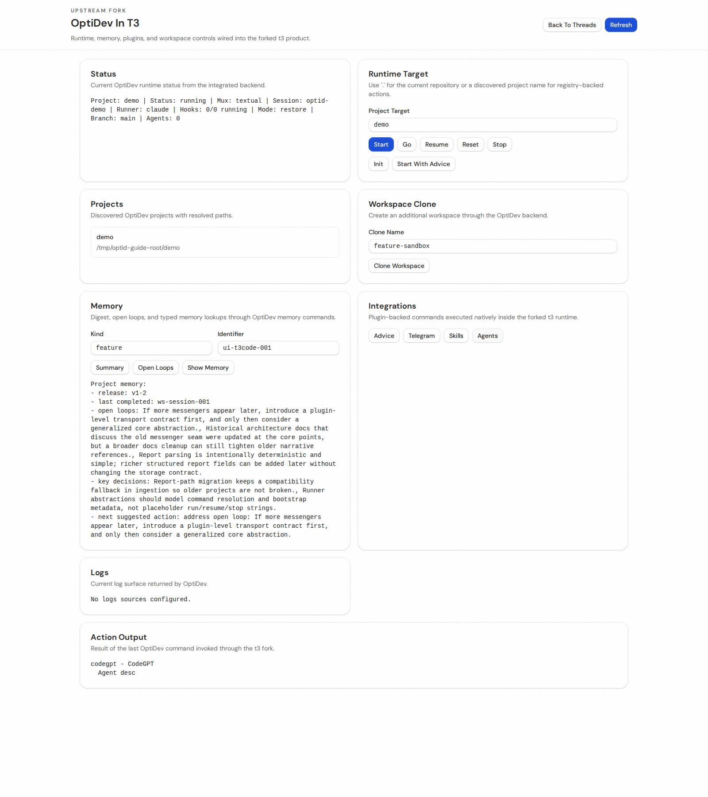

# OptiDev In T3 Code: Pain-Driven Guide

`t3code` is the main product shell in `./ui`. `OptiDev` is not a separate app anymore: it is the workspace-operations route inside the forked `t3code` product, available at `/optidev`.

## Start Here: Where Is T3 Code?
1. Install and build the fork:
   - `cd ui && bun install --ignore-scripts`
   - `cd ui && bun run build`
2. Start the forked server:
   - `cd ui/apps/server && T3CODE_NO_BROWSER=true bun run dev`
3. Open the main `t3code` shell:
   - `http://127.0.0.1:3773/_chat/`
4. From there, click `Open OptiDev`.

## Pain: "I have a chat shell, but nowhere to operate the repo"
Situation:
You are already inside the forked `t3code` shell, but you need project state, runtime control, memory, and repo integrations in one place.

Solution with `t3code` + `optid`:
Open `/optidev` from the `t3code` shell. `t3code` stays the host UI, and OptiDev becomes the project-operations surface inside it.

## Pain: "I do not know what is running, for which project, or where logs live"
Situation:
A common failure mode is losing runtime awareness after a few context switches.

Solution with `t3code` + `optid`:
Use the `/optidev` overview to see:
- active project
- current runtime status
- mux backend
- runner
- discovered projects
- current logs surface

If you need terminal parity, use `optid status` and `optid logs`.

## Pain: "I come back later and waste time reconstructing context"
Situation:
You already had a workspace, but you need to restore it without manually rebuilding prompts, runner state, or layout artifacts.

Solution with `t3code` + `optid`:
Set `Runtime Target` to the project and press `Resume`. This restores the session and surfaces the resulting state directly inside `t3code`.

CLI equivalent:
`optid resume <project>`

## Pain: "I need a task-specific workspace without hand-editing manifests"
Situation:
You want a separate branch/task workspace, but doing it by hand creates drift and forgotten state files.

Solution with `t3code` + `optid`:
Use `Clone Workspace`. OptiDev writes `.optidev/workspaces/<name>/workspace.yaml` for you, so the workspace split is explicit and repeatable.

CLI equivalent:
`optid workspace clone <name>`

## Pain: "The team keeps re-solving the same open loops"
Situation:
Reports, release docs, and session artifacts exist, but the unresolved work is buried across files.

Solution with `t3code` + `optid`:
Use `Open Loops` in `/optidev`. That pulls unresolved work into one focused result instead of making you scan `tasks-log/` manually.

CLI equivalent:
`optid memory open-loops`

## Pain: "I need exact memory, not just a vague summary"
Situation:
You need a specific feature, task, or release record while staying in the same `t3code` session.

Solution with `t3code` + `optid`:
Use typed memory lookup with `Kind` + `Identifier`, then press `Show Memory`. This turns the guide/report corpus into a direct lookup surface.

CLI equivalent:
- `optid memory`
- `optid memory show feature <id>`
- `optid memory show task <id>`
- `optid memory show release <id>`

## Pain: "A fresh repo always needs the same bootstrap thinking"
Situation:
You open a repo and repeatedly spend time re-deriving stack, tooling, and first moves.

Solution with `t3code` + `optid`:
Use `Advice`. This gives a compact repository summary and startup guidance without leaving the integrated `t3code` flow.

CLI equivalent:
- `optid advice`
- `optid start <project> --advice`
- `optid go <project> --advice`

## Pain: "I need updates when I am away from the terminal"
Situation:
You want remote awareness of the active workspace without wiring another sidecar process by hand.

Solution with `t3code` + `optid`:
Use the Telegram integration from OptiDev. UI and CLI share the same state, so the active workspace remains the single Telegram-connected workspace.

CLI equivalent:
- `optid telegram start`
- `optid telegram status`
- `optid telegram stop`

## Pain: "I keep wasting time searching for the right repo skills"
Situation:
You know a reusable skill probably exists, but the search/install loop interrupts active work.

Solution with `t3code` + `optid`:
Search skills directly from `/optidev`, then install them into the current project under `.agents/skills/`.

CLI equivalent:
- `optid skills search <query>`
- `optid skills install <spec>`

## Pain: "I need a reusable agent, not another one-off prompt"
Situation:
The repo would benefit from a dedicated agent, but discovery and install are usually disconnected from the current workspace state.

Solution with `t3code` + `optid`:
Use the Agents integration from `/optidev`. Installed agents land in `.agents/agents/`, so the repo keeps the agent definition close to the work.

CLI equivalent:
- `optid agents search <query>`
- `optid agents install <slug>`

## Mental Model
- `t3code` is the host product and the place you stay open all day.
- `/optidev` is the repo-operations route inside that product.
- `optid` is the terminal twin of the same runtime, useful when the browser is not the fastest path.
