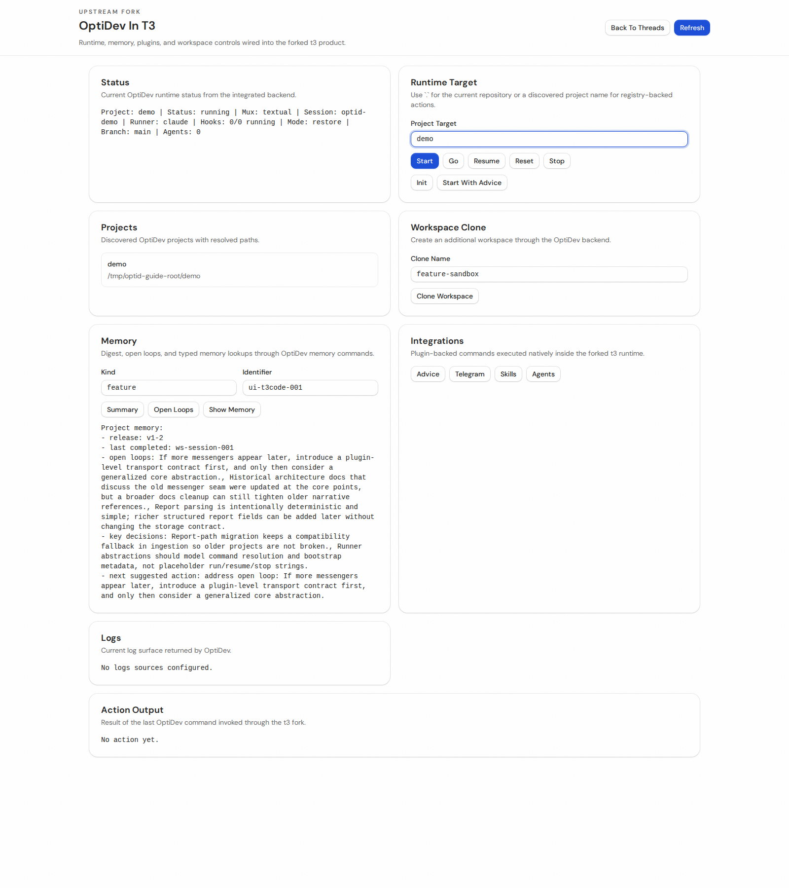
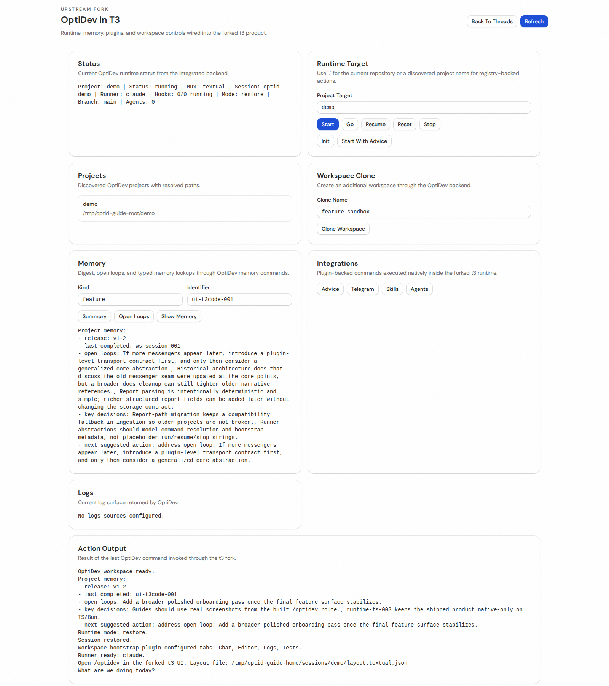
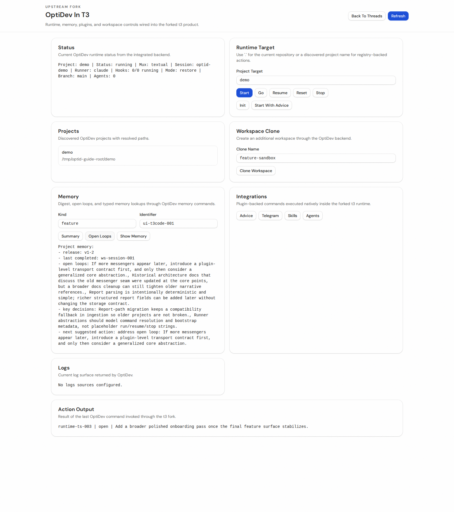
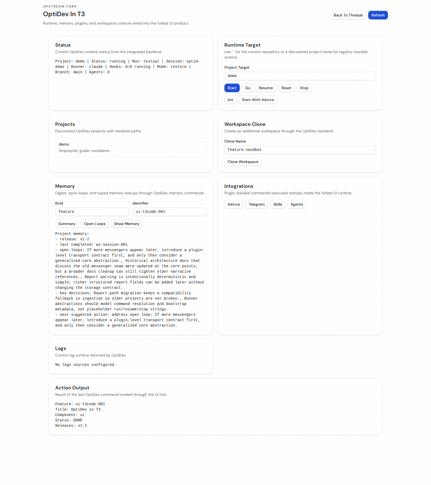
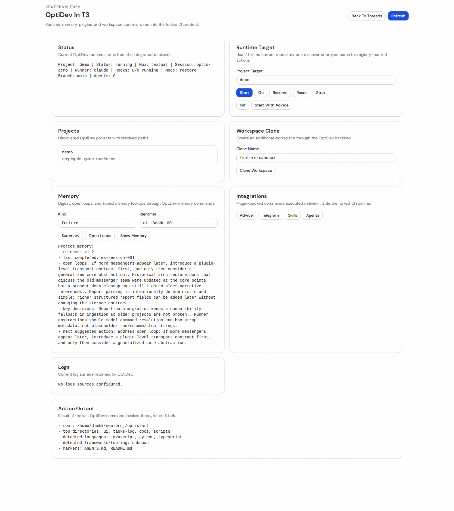

# OptiDev In T3 Code: Current UI Guide

`t3code` is the host product in `./ui`. `OptiDev` is the workspace-operations route inside that product at `/optidev`.

Note:
Some screenshots in this guide still show an older visual pass. Treat the text, route names, and current tab labels as the authoritative contract until the screenshot set is refreshed.

## Start Here
1. Install and build the fork:
   - `cd ui && bun install --ignore-scripts`
   - `cd ui && bun run build`
2. Start the forked server:
   - `cd ui/apps/server && T3CODE_NO_BROWSER=true bun run dev`
3. Open the main shell:
   - `http://127.0.0.1:3773/_chat/`
4. Click `Open OptiDev`, or go directly to:
   - `http://127.0.0.1:3773/optidev`

## Pain: "I need repo files, but markdown keeps looking wrong"
Situation:
You want to inspect docs and reports in the same shell without maintaining a second markdown renderer just for OptiDev.

Solution with `t3code` + `optid`:
Open the `Files` tab. Repository browsing stays read-only, and markdown files render through the same shared t3 markdown path used by the rest of the web app.

Use cases:
- inspect `docs/tasks/*.md`
- read `tasks-log/*.md`
- switch between rendered markdown and source when needed

## Pain: "I do not trust the workspace controls because I cannot see the contract"
Situation:
Runtime buttons alone do not explain what workspace state will actually be applied next.

Solution with `t3code` + `optid`:
Open the `OptiDev` tab. The primary surface is the live `.optidev/workspace.yaml` manifest, not the runtime buttons.

What you can do there:
- inspect the resolved manifest summary
- edit manifest YAML directly
- save it without leaving the shell
- preview what will change before you apply it

CLI equivalent:
- `optid start <project>`
- `optid resume <project>`
- `optid reset <project>`

## Pain: "If I change branch, task, or hooks, I want to know the consequence first"
Situation:
Editing a manifest is useful only if the UI makes the runtime impact explicit.

Solution with `t3code` + `optid`:
Use `What Changes If You Edit It`. The draft impact preview compares the current saved manifest with your draft and the live session contract.

The screen calls out:
- branch and active task deltas
- mux/runtime implications
- agent and service count changes
- why runtime controls still exist after the manifest is saved

## Pain: "Runtime controls still feel weird in a manifest-first tool"
Situation:
It is easy to assume `Start`, `Resume`, `Reset`, and `Stop` are the real source of truth.

Solution with `t3code` + `optid`:
The UI now treats runtime controls as secondary actions that apply the saved manifest to the live workspace.

Mental model:
- save the manifest first
- use `Start` or `Resume` to reconcile runtime with that saved contract
- use `Reset` when the saved contract is correct but local runtime/session state is not
- use `Stop` only to end the live session; it does not rewrite the manifest
- use `Clone` to derive another workspace manifest under `.optidev/workspaces/<name>/workspace.yaml`

CLI equivalent:
- `optid workspace clone <name>`

## Pain: "The memory story says graph, but the UI used to feel flat"
Situation:
The storage is already graph-backed, but a fake node canvas would only create more confusion.

Solution with `t3code` + `optid`:
The `Memory` card exposes the real graph-backed state first:
- node and edge counts
- feature and open-loop counts
- current memory digest lines
- a concrete graph-view implementation path

You still get exact lookup actions from the same screen:
- `Show` for typed memory lookup
- `Open loops` for unresolved work

CLI equivalent:
- `optid memory`
- `optid memory show feature <id>`
- `optid memory show task <id>`
- `optid memory show release <id>`
- `optid memory open-loops`

## Pain: "I need a practical path to a visual memory graph"
Situation:
The team wanted graph storage and a graph representation, but the implementation needs to preserve node identity and user state.

Solution with `t3code` + `optid`:
Treat the current `memory-graph` payload as the stable base contract:
- nodes and edges already have durable IDs
- lane-style layout is deterministic today
- filters, selection, and pinned nodes can be persisted by node ID later
- a real graph canvas can be added without changing the storage model first

The current UI surfaces that plan directly instead of pretending the graph problem is already solved.

## Pain: "I only want to know which plugins exist right now"
Situation:
The old Plugins tab mixed inventory, editing, and config concerns into one noisy screen.

Solution with `t3code` + `optid`:
The `Plugins` tab is intentionally reduced to a current inventory of native runtime plugins:
- `Advice`
- `Telegram`
- `Skills`
- `Agents`

For each plugin, the UI shows category, enabled state, and key details. File editing is intentionally out of the path for now.

## Pain: "I want Telegram to keep following the real active session"
Situation:
A hidden stale pin is worse than no pin at all, because messages go to the wrong conversation.

Solution with `t3code` + `optid`:
Telegram now has two explicit modes:
- explicit pin: a UI-triggered start can bind Telegram to a concrete thread
- auto-target: plain `optid telegram start` clears stale saved pins and attaches to the best available active session

Useful commands:
- `optid telegram start`
- `optid telegram status`
- `optid telegram stop`

## Mental Model
- `t3code` is the host product you keep open.
- `/optidev` is the workspace-operations route inside that product.
- `Files` is for repo inspection with the shared markdown renderer.
- `OptiDev` is for manifest-first workspace control plus live session context.
- `Plugins` is a clean runtime inventory, not a file editor.
- `optid` is the terminal twin of the same runtime when the shell is faster than the browser.
